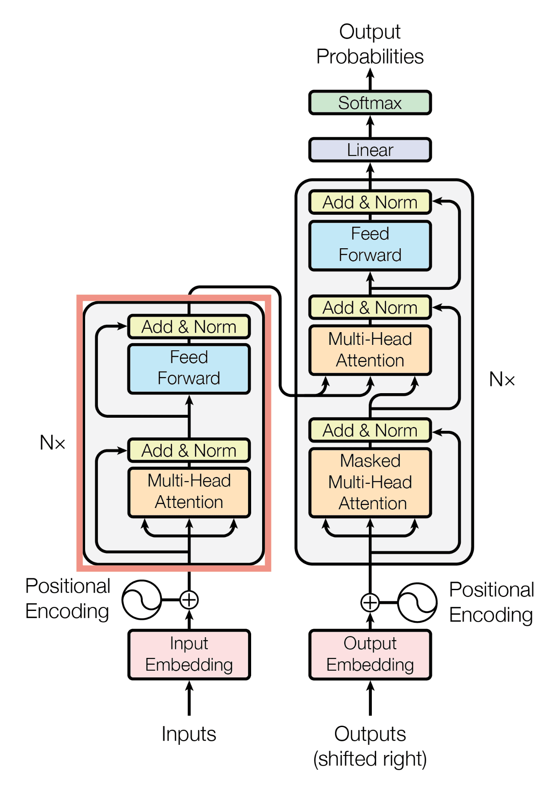
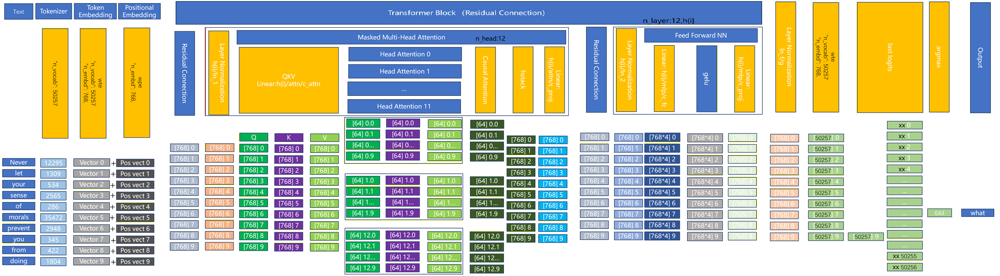
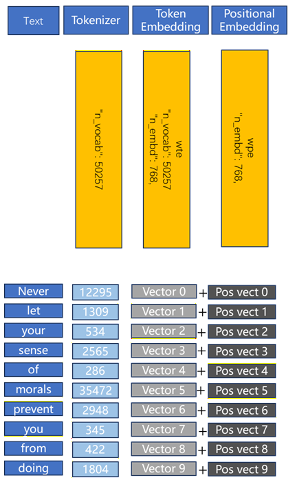
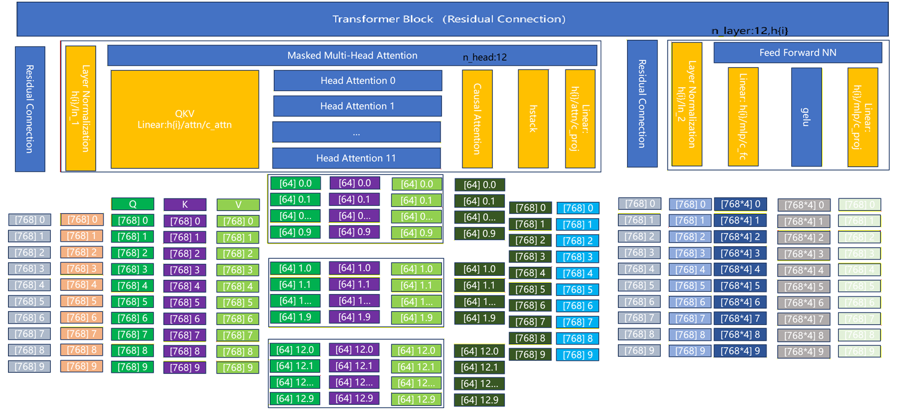
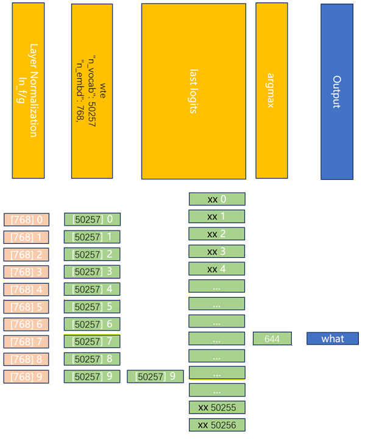
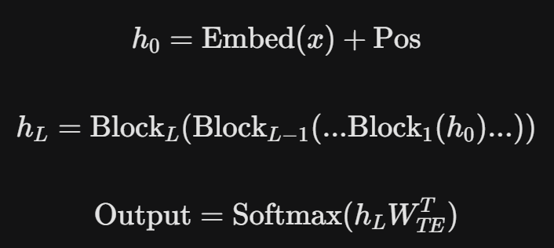

# 第1章：跑通一个简单大语言模型的推理

## 1.1 跑通一个简单大语言模型的推理

先用使用尽可能少的依赖库（此处tensorflow仅用于加载参数），加载一个GPT-2模型并进行简单的生成式推理。

GPT-2（Generative Pre-trained Transformer 2）是 OpenAI 在 2019 年发布的一种自回归语言模型。它是大模型时代的“开山鼻祖”之一，是引爆了全球 AI 热潮GPT-3.5 的前身，确立了**预训练（Pre-training）\**加\**微调（Fine-tuning）**，以及**零样本学习（Zero-shot Learning）**的技术路线。

```
import sys
import os
import requests
import json
import numpy as np
import tensorflow as tf

from encoder import get_encoder

# === 1. 权重加载与自回归生成 ===
def load_params(model_path, n_layer):
    ckpt_path = tf.train.latest_checkpoint(model_path)
    vars = {name: tf.train.load_variable(ckpt_path, name).squeeze() for name, _ in tf.train.list_variables(ckpt_path)}
    params = {"wte": vars["model/wte"], "wpe": vars["model/wpe"], "blocks": [], "ln_f": {"g": vars["model/ln_f/g"], "b": vars["model/ln_f/b"]}}
    for i in range(n_layer):
        params["blocks"].append({
            "attn": {"c_attn": {"w": vars[f"model/h{i}/attn/c_attn/w"], "b": vars[f"model/h{i}/attn/c_attn/b"]},
                     "c_proj": {"w": vars[f"model/h{i}/attn/c_proj/w"], "b": vars[f"model/h{i}/attn/c_proj/b"]}},
            "mlp": {"c_fc": {"w": vars[f"model/h{i}/mlp/c_fc/w"], "b": vars[f"model/h{i}/mlp/c_fc/b"]},
                    "c_proj": {"w": vars[f"model/h{i}/mlp/c_proj/w"], "b": vars[f"model/h{i}/mlp/c_proj/b"]}},
            "ln_1": {"g": vars[f"model/h{i}/ln_1/g"], "b": vars[f"model/h{i}/ln_1/b"]},
            "ln_2": {"g": vars[f"model/h{i}/ln_2/g"], "b": vars[f"model/h{i}/ln_2/b"]},
        })
    return params


# === 2. 核心数学组件 (NumPy) ===
def linear(x, w, b):  # [m, in], [in, out], [out] -> [m, out]
    return x @ w + b

def layer_norm(x, g, b, eps: float = 1e-5):
    mean = np.mean(x, axis=-1, keepdims=True)
    variance = np.var(x, axis=-1, keepdims=True)
    x = (x - mean) / np.sqrt(variance + eps)  # normalize x to have mean=0 and var=1 over last axis
    return g * x + b  # scale and offset with gamma/beta params

def softmax(x):
    exp_x = np.exp(x - np.max(x, axis=-1, keepdims=True))
    return exp_x / np.sum(exp_x, axis=-1, keepdims=True)

def gelu(x):
    return 0.5 * x * (1 + np.tanh(np.sqrt(2 / np.pi) * (x + 0.044715 * x**3)))

def attention(q, k, v, mask):  # [n_q, d_k], [n_k, d_k], [n_k, d_v], [n_q, n_k] -> [n_q, d_v]
    return softmax(q @ k.T / np.sqrt(q.shape[-1]) + mask) @ v

def mha(x, c_attn, c_proj, n_head):  # [n_seq, n_embd] -> [n_seq, n_embd]
    # qkv projection
    x = linear(x, c_attn['w'], c_attn['b'])  # [n_seq, n_embd] -> [n_seq, 3*n_embd]

    # split into qkv
    qkv = np.split(x, 3, axis=-1)  # [n_seq, 3*n_embd] -> [3, n_seq, n_embd]

    # split into heads
    qkv_heads = list(map(lambda x: np.split(x, n_head, axis=-1), qkv))  # [3, n_seq, n_embd] -> [3, n_head, n_seq, n_embd/n_head]

    # causal mask to hide future inputs from being attended to
    causal_mask = (1 - np.tri(x.shape[0], dtype=x.dtype)) * -1e10  # [n_seq, n_seq]

    # perform attention over each head
    out_heads = [attention(q, k, v, causal_mask) for q, k, v in zip(*qkv_heads)]  # [3, n_head, n_seq, n_embd/n_head] -> [n_head, n_seq, n_embd/n_head]

    # merge heads
    x = np.hstack(out_heads)  # [n_head, n_seq, n_embd/n_head] -> [n_seq, n_embd]

    # out projection
    x = linear(x, c_proj['w'], c_proj['b'])  # [n_seq, n_embd] -> [n_seq, n_embd]

    return x

def ffn(x, c_fc, c_proj):  # [n_seq, n_embd] -> [n_seq, n_embd]
    # project up
    a = gelu(linear(x, c_fc['w'], c_fc['b']))  # [n_seq, n_embd] -> [n_seq, 4*n_embd]

    # project back down
    x = linear(a, c_proj['w'], c_proj['b'])  # [n_seq, 4*n_embd] -> [n_seq, n_embd]

    return x

def transformer_block(x, mlp, attn, ln_1, ln_2, n_head):  # [n_seq, n_embd] -> [n_seq, n_embd]
    # multi-head causal self attention
    x = x + mha(layer_norm(x, ln_1['g'], ln_1['b']), attn['c_attn'], attn['c_proj'], n_head)  # [n_seq, n_embd] -> [n_seq, n_embd]

    # position-wise feed forward network
    x = x + ffn(layer_norm(x, ln_2['g'], ln_2['b']), mlp['c_fc'], mlp['c_proj'])  # [n_seq, n_embd] -> [n_seq, n_embd]

    return x

def gpt2(inputs, wte, wpe, blocks, ln_f, n_head):  # [n_seq] -> [n_seq, n_vocab]
    # token + positional embeddings
    x = wte[inputs] + wpe[np.arange(len(inputs))]  # [n_seq] -> [n_seq, n_embd]

    # forward pass through n_layer transformer blocks
    for block in blocks:
        x = transformer_block(x, block['mlp'], block['attn'], block['ln_1'], block['ln_2'], n_head)  # [n_seq, n_embd] -> [n_seq, n_embd]
    x = layer_norm(x, ln_f['g'], ln_f['b'])  # [n_seq, n_embd] -> [n_seq, n_embd]
    logits = x @ wte.T  # [n_seq, n_embd] -> [n_seq, n_vocab]
    return logits  # [n_seq, n_vocab]

def generate(params, input_ids, n_head, n_ctx, eos, n_len=10):
    output_ids = list(input_ids)
    for _ in range(n_len):  # auto-regressive decode loop
        curr_input = output_ids[-n_ctx:] # 裁剪至模型最大上下文
        
        logits = gpt2(curr_input, params['wte'], params['wpe'], params['blocks'], params['ln_f'], n_head)  # model forward pass
        
        # 贪婪搜索：取概率最大的下一个 Token
        next_id = np.argmax(logits[-1])
        output_ids.append(next_id) # append prediction to input
        if next_id == eos: break # 遇到结束符停止
    return output_ids

def download_file(url, path):
    if not os.path.exists(path):
        print(f"Downloading {url}...")
        r = requests.get(url, stream=True)
        with open(path, 'wb') as f: f.write(r.content)

# === 3. 运行 ===
def main(prompt):
    models_dir: str = "models"
    model_size = "124M" # 有 124M, 355M, 774M, 1558M 可选
    model_dir = f"{models_dir}/{model_size}"
    os.makedirs(model_dir, exist_ok=True)
    base_url = "https://openaipublic.blob.core.windows.net/gpt-2/models"
    
    # 下载模型文件
    for f in ["checkpoint", "encoder.json", "hparams.json", "model.ckpt.data-00000-of-00001", "model.ckpt.index", "model.ckpt.meta", "vocab.bpe"]:
        download_file(f"{base_url}/{model_dir}/{f}", os.path.join(model_dir, f))
    
    with open(f"{model_dir}/encoder.json", "r") as f: encoder = json.load(f)
    with open(f"{model_dir}/hparams.json", "r") as f: hparams = json.load(f)
    
    encoder = get_encoder(model_size, models_dir)
    n_layer = hparams["n_layer"]
    
    params = load_params(model_dir, n_layer)
    
    n_head = hparams["n_head"]
    n_ctx = hparams["n_ctx"]
    n_vocab = hparams["n_vocab"]

    print(f"\nPrompt: {prompt}")
    input_ids = encoder.encode(prompt)
    print(f"\ninput_ids: {input_ids}")
    output_ids = generate(params, input_ids, n_head, n_ctx, eos=n_vocab-1, n_len=8)
    print(f"\noutput_ids: {output_ids}")
    result_text = encoder.decode(output_ids)
    print(f"Generated: {result_text}")

if __name__ == "__main__":
    if len(sys.argv) <= 1:
        print(sys.argv)
        exit(0)
    main(sys.argv[1])
```

```
#python gpt2.py "Never let your sense of morals prevent you from doing" 

# what you love.
```

此次由于模型参数较少，推理效果受限，但是已经展现了极大的潜力，为后续大模型奠定了基础。

其中 encoder.py来自于openai的开源参考，直接复制过来即可使用。

```
"""
Byte pair encoding utilities.
Copied from: https://github.com/openai/gpt-2/blob/master/src/encoder.py.
"""
import json
import os
from functools import lru_cache
import regex as re

@lru_cache()
def bytes_to_unicode():
    """
    Returns list of utf-8 byte and a corresponding list of unicode strings.
    The reversible bpe codes work on unicode strings.
    This means you need a large # of unicode characters in your vocab if you want to avoid UNKs.
    When you're at something like a 10B token dataset you end up needing around 5K for decent coverage.
    This is a significant percentage of your normal, say, 32K bpe vocab.
    To avoid that, we want lookup tables between utf-8 bytes and unicode strings.
    And avoids mapping to whitespace/control characters the bpe code barfs on.
    """
    bs = list(range(ord("!"), ord("~") + 1)) + list(range(ord("¡"), ord("¬") + 1)) + list(range(ord("®"), ord("ÿ") + 1))
    cs = bs[:]
    n = 0
    for b in range(2**8):
        if b not in bs:
            bs.append(b)
            cs.append(2**8 + n)
            n += 1
    cs = [chr(n) for n in cs]
    return dict(zip(bs, cs))


def get_pairs(word):
    """Return set of symbol pairs in a word.
    Word is represented as tuple of symbols (symbols being variable-length strings).
    """
    pairs = set()
    prev_char = word[0]
    for char in word[1:]:
        pairs.add((prev_char, char))
        prev_char = char
    return pairs


class Encoder:
    def __init__(self, encoder, bpe_merges, errors="replace"):
        self.encoder = encoder
        self.decoder = {v: k for k, v in self.encoder.items()}
        self.errors = errors  # how to handle errors in decoding
        self.byte_encoder = bytes_to_unicode()
        self.byte_decoder = {v: k for k, v in self.byte_encoder.items()}
        self.bpe_ranks = dict(zip(bpe_merges, range(len(bpe_merges))))
        self.cache = {}

        # Should have added re.IGNORECASE so BPE merges can happen for capitalized versions of contractions
        self.pat = re.compile(r"""'s|'t|'re|'ve|'m|'ll|'d| ?\p{L}+| ?\p{N}+| ?[^\s\p{L}\p{N}]+|\s+(?!\S)|\s+""")

    def bpe(self, token):
        if token in self.cache:
            return self.cache[token]
        word = tuple(token)
        pairs = get_pairs(word)

        if not pairs:
            return token

        while True:
            bigram = min(pairs, key=lambda pair: self.bpe_ranks.get(pair, float("inf")))
            if bigram not in self.bpe_ranks:
                break
            first, second = bigram
            new_word = []
            i = 0
            while i < len(word):
                try:
                    j = word.index(first, i)
                    new_word.extend(word[i:j])
                    i = j
                except:
                    new_word.extend(word[i:])
                    break

                if word[i] == first and i < len(word) - 1 and word[i + 1] == second:
                    new_word.append(first + second)
                    i += 2
                else:
                    new_word.append(word[i])
                    i += 1
            new_word = tuple(new_word)
            word = new_word
            if len(word) == 1:
                break
            else:
                pairs = get_pairs(word)
        word = " ".join(word)
        self.cache[token] = word
        return word

    def encode(self, text):
        bpe_tokens = []
        for token in re.findall(self.pat, text):
            token = "".join(self.byte_encoder[b] for b in token.encode("utf-8"))
            bpe_tokens.extend(self.encoder[bpe_token] for bpe_token in self.bpe(token).split(" "))
        return bpe_tokens

    def decode(self, tokens):
        text = "".join([self.decoder[token] for token in tokens])
        text = bytearray([self.byte_decoder[c] for c in text]).decode("utf-8", errors=self.errors)
        return text


def get_encoder(model_name, models_dir):
    with open(os.path.join(models_dir, model_name, "encoder.json"), "r") as f:
        encoder = json.load(f)
    with open(os.path.join(models_dir, model_name, "vocab.bpe"), "r", encoding="utf-8") as f:
        bpe_data = f.read()
    bpe_merges = [tuple(merge_str.split()) for merge_str in bpe_data.split("\n")[1:-1]]
    return Encoder(encoder=encoder, bpe_merges=bpe_merges)
```

以下是 GPT-2 开展的简单介绍：


### 1. 核心架构：仅解码器（Decoder-only）

GPT-2 沿用了第一代 GPT 的核心设计，采用了 **Transformer 解码器** 结构。与原始 Transformer 不同，它去掉了编码器部分，专注于根据上文预测下一个词。

- **掩码自注意力机制（Masked Self-Attention）：** 确保模型在预测当前词时，只能看到之前的词，而不能“偷看”后面的答案。
- **层数与规模：** GPT-2 有四个版本，最小的（Small）为 1.24 亿参数，最大的（Extra Large）达到了 15 亿参数。


### 2. 技术突破：零样本学习

在 GPT-2 之前，大多数模型需要针对特定任务（如翻译或摘要）进行专门的训练。OpenAI 的研究人员发现，如果模型在一个足够大的数据集上进行预训练，它就能通过简单的提示（Prompt）来完成任务，而无需重新训练。

- **数据集 WebText：** 从 Reddit 上高赞链接中爬取的 40GB 文本数据，涵盖了极广的知识面。
- **概率建模：** 模型学习的是文本的概率分布 P(output|input)。

| **版本名称**           | **参数量** | **层数 (Layers)** | **隐藏层维度 (dmodel)** |
| ---------------------- | ---------- | ----------------- | ----------------------- |
| **Small** (124M)       | 1.24 亿    | 12                | 768                     |
| **Medium** (355M)      | 3.55 亿    | 24                | 1024                    |
| **Large** (774M)       | 7.74 亿    | 36                | 1280                    |
| **Extra Large** (1.5B) | 15.5 亿    | 48                | 1600                    |

### 4. 为什么 GPT-2 在当时引起了轰动？

1. **文本生成的质量：** 在 2019 年，GPT-2 生成的段落逻辑连贯性远超以往模型，甚至达到了“以假乱真”的程度。
2. **跳出专用化：** 它证明了“规模化（Scaling Laws）”的潜力——即增加参数和数据量能显著提升模型的智能。
3. **安全争议：** 由于担心被用于生成虚假新闻，OpenAI 最初拒绝发布 15 亿参数的完整版本，这在当时引发了关于 AI 伦理的大讨论。


### 5. 核心原理图示

GPT-2 的工作流程可以简单概括为：**输入词向量 + 位置编码 --> 多层 Transformer Block  --> 预测下一个 Token 的概率分布**。

虽然现在的 GPT-4o 或 Claude 3.5 在智能上已经超越 GPT-2 数千倍，但 GPT-2 的基本结构和推理逻辑（即我们刚才用 NumPy 实现的那套数学逻辑）依然是现代生成式 AI 的基石。


## 1.2 大语言模型推理基础知识介绍

### 1.2.1 大语言模型经典架构Transformer 

谈及大语言模型就不能绕开Transformer ，Transformer 架构由 Google 在 2017 年的论文 *《Attention is All You Need》* 中提出。它彻底抛弃了传统的循环神经网络（RNN）和卷积神经网络（CNN），完全依赖 **注意力机制（Attention）** 来处理序列数据。

其结构可以拆解为以下几个核心部分：

- **编码器 (Encoder)**：负责将输入序列（如一句话）转换成高维的特征表示（理解上下文）。
- **解码器 (Decoder)**：负责根据编码器的输出和已生成的单词，预测下一个单词（生成回复）。

像 GPT 系列的生成式模型一般使用“仅解码器”（decoder-only）结构，而 “仅编码器”（encoder-only）结构一般用于BERT 等理解型模型。



这张经典图片来自于论文 *《Attention is All You Need》*，在生成式大语言模型中一般只用到右侧decoder部分。

> 可能有细心的读者会注意到右侧下方写的是Outputs（shifted right）而不是inputs，是因为Transformer 原本是用于进行语言翻译的：
>
> **左侧 Encoder** 输入“源语言”（例如中文：*“世界你好”*），这就是模型的 **Inputs**。
>
> **右侧 Decoder** 处理的是“目标语言”（例如英文：*“Hello World”*）。由于它是模型要生成的最终结果，所以被标注为 **Outputs**，同时 也是为了强调：这部分数据要来自于模型自己产生的序列。


### 1.2.2 仅解码器decoder-only模型具体结构

接下来以GPT-2模型为例介绍decoder-only模型的结构，先画出总图（选用124M参选的模型），表示从"Never let your sense of morals prevent you from doing" 生成第一个单词"what"的过程。



我们可以按照数据从进入模型到输出结果的顺序，逐层进行拆解：

------

### 1. 输入层（Input Stage）



这是模型接触原始文本的第一步。

- **词元化(Tokenizer)**：将文本转换为ID（124M 模型中支持词元个数为 50257）。
- **词嵌入（Token Embeddings, WTE）**：将分词后的 ID 转换为高维向量（124M 模型中维度为 768）。
- **位置嵌入（Positional Embeddings, WPE）**：由于 Transformer 无法感知顺序，GPT-2 使用一套可学习的向量，为每个位置（0 到 1023）赋予特定的坐标信息。
- **相加（Summation）**：将词向量与位置向量直接相加，得到携带顺序信息的初始语义向量。

------

### 2. Transformer 层（Transformer Blocks）



这是模型的核心，GPT-2 (124M) 共有 **12 层** 这样的重复结构。每一层包含两个主要子层：

#### A. 自注意力子层（Masked Multi-Head Attention）

- **掩码（Masking，Causal Attention中执行）**：这是 GPT-2 生成能力的关键。它通过一个三角矩阵遮住未来的信息，确保预测第 n 个词时只能看到前 n-1 个词。
- **多头（Multi-Head）**：模型并行的 12 个“头”分别关注不同的关联。比如一个头关注语法，另一个头关注代词指代。
- **层归一化（Pre-Layer Norm）**：GPT-2 将 LayerNorm 放在了注意力机制**之前**，这与原始 Transformer 不同，有助于稳定深层网络的训练。

#### B. 前馈网络子层（Feed-Forward Network, FFN）

- **维度扩展**：向量会先通过线性层扩大 4 倍（从 768 升到 3072），然后再压缩回来。
- **GELU 激活函数**：相比 ReLU，GELU 更加平滑，有助于捕捉复杂的非线性特征。

#### C. 残差连接（Residual Connections）

- 每一层的结果都会加上该层的原始输入（x + Sublayer(x)）。这像是一条“高速公路”，允许信息不经损失地流向更深层，防止模型在堆叠过程中“迷失”。

------

### 3. 输出层（Output Stage）



当向量穿过所有 12 层 Block 后，它已经包含了极其丰富的上下文语义。

- **最终归一化（Final Layer Norm）**：对最后一层的输出进行标准化。
- **线性映射（Linear Head）**：将向量映射回词表大小（约 50257 维）。
- **Softmax**：将映射结果转换为概率分布。概率最高的 Token ID 就是模型预测的下一个词。
- **词元Token ID转回文本**：将概率最高的 Token ID转回单词，从词表（50257 ）中找出对应单词。

------

### 总结：GPT-2 的“流水线”视图

我们可以用这个公式来概括每一层的演变：



**有趣的一点：**

在 GPT-2 中，输出层的线性映射权重通常与输入层的 Embedding 权重是**共享（Tying）**的。这意味着模型用同样的“理解”去把单词转成向量，也用同样的“理解”把向量还原回单词。


以上概念可能一开始不能全部消化，不用担心，后文中会逐个详细介绍。


