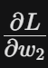
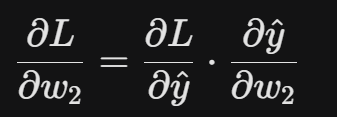
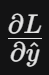
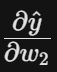
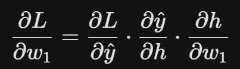
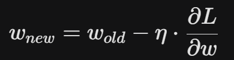
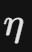

# 第2章：跑通一个简单大语言模型的训练

## 2.1 跑通一个简单大语言模型的训练

由于模型训练比较复杂，我们没有一上来就训练一个GPT-2规模的大模型，而是从一个小的大语言模型microgpt.py开始学习预训练，这是一个起英文名字的大模型，来自于大神 karpathy （ https://gist.github.com/karpathy/8627fe009c40f57531cb18360106ce95 ）。

```
"""
The most atomic way to train and run inference for a GPT in pure, dependency-free Python.
This file is the complete algorithm.
Everything else is just efficiency.
@karpathy
"""

import os       # os.path.exists
import math     # math.log, math.exp
import random   # random.seed, random.choices, random.gauss, random.shuffle
random.seed(42) # Let there be order among chaos

# Let there be a Dataset `docs`: list[str] of documents (e.g. a list of names)
if not os.path.exists('input.txt'):
    import urllib.request
    names_url = 'https://raw.githubusercontent.com/karpathy/makemore/988aa59/names.txt'
    urllib.request.urlretrieve(names_url, 'input.txt')
docs = [line.strip() for line in open('input.txt') if line.strip()]
random.shuffle(docs)
print(f"num docs: {len(docs)}")

# Let there be a Tokenizer to translate strings to sequences of integers ("tokens") and back
uchars = sorted(set(''.join(docs))) # unique characters in the dataset become token ids 0..n-1
BOS = len(uchars) # token id for a special Beginning of Sequence (BOS) token
vocab_size = len(uchars) + 1 # total number of unique tokens, +1 is for BOS
print(f"vocab size: {vocab_size}")

# Let there be Autograd to recursively apply the chain rule through a computation graph
class Value:
    __slots__ = ('data', 'grad', '_children', '_local_grads') # Python optimization for memory usage

    def __init__(self, data, children=(), local_grads=()):
        self.data = data                # scalar value of this node calculated during forward pass
        self.grad = 0                   # derivative of the loss w.r.t. this node, calculated in backward pass
        self._children = children       # children of this node in the computation graph
        self._local_grads = local_grads # local derivative of this node w.r.t. its children

    def __add__(self, other):
        other = other if isinstance(other, Value) else Value(other)
        return Value(self.data + other.data, (self, other), (1, 1))

    def __mul__(self, other):
        other = other if isinstance(other, Value) else Value(other)
        return Value(self.data * other.data, (self, other), (other.data, self.data))

    def __pow__(self, other): return Value(self.data**other, (self,), (other * self.data**(other-1),))
    def log(self): return Value(math.log(self.data), (self,), (1/self.data,))
    def exp(self): return Value(math.exp(self.data), (self,), (math.exp(self.data),))
    def relu(self): return Value(max(0, self.data), (self,), (float(self.data > 0),))
    def __neg__(self): return self * -1
    def __radd__(self, other): return self + other
    def __sub__(self, other): return self + (-other)
    def __rsub__(self, other): return other + (-self)
    def __rmul__(self, other): return self * other
    def __truediv__(self, other): return self * other**-1
    def __rtruediv__(self, other): return other * self**-1

    def backward(self):
        topo = []
        visited = set()
        def build_topo(v):
            if v not in visited:
                visited.add(v)
                for child in v._children:
                    build_topo(child)
                topo.append(v)
        build_topo(self)
        self.grad = 1
        for v in reversed(topo):
            for child, local_grad in zip(v._children, v._local_grads):
                child.grad += local_grad * v.grad

# Initialize the parameters, to store the knowledge of the model
n_layer = 1     # depth of the transformer neural network (number of layers)
n_embd = 16     # width of the network (embedding dimension)
block_size = 16 # maximum context length of the attention window (note: the longest name is 15 characters)
n_head = 4      # number of attention heads
head_dim = n_embd // n_head # derived dimension of each head
matrix = lambda nout, nin, std=0.08: [[Value(random.gauss(0, std)) for _ in range(nin)] for _ in range(nout)]
state_dict = {'wte': matrix(vocab_size, n_embd), 'wpe': matrix(block_size, n_embd), 'lm_head': matrix(vocab_size, n_embd)}
for i in range(n_layer):
    state_dict[f'layer{i}.attn_wq'] = matrix(n_embd, n_embd)
    state_dict[f'layer{i}.attn_wk'] = matrix(n_embd, n_embd)
    state_dict[f'layer{i}.attn_wv'] = matrix(n_embd, n_embd)
    state_dict[f'layer{i}.attn_wo'] = matrix(n_embd, n_embd)
    state_dict[f'layer{i}.mlp_fc1'] = matrix(4 * n_embd, n_embd)
    state_dict[f'layer{i}.mlp_fc2'] = matrix(n_embd, 4 * n_embd)
params = [p for mat in state_dict.values() for row in mat for p in row] # flatten params into a single list[Value]
print(f"num params: {len(params)}")

# Define the model architecture: a function mapping tokens and parameters to logits over what comes next
# Follow GPT-2, blessed among the GPTs, with minor differences: layernorm -> rmsnorm, no biases, GeLU -> ReLU
def linear(x, w):
    return [sum(wi * xi for wi, xi in zip(wo, x)) for wo in w]

def softmax(logits):
    max_val = max(val.data for val in logits)
    exps = [(val - max_val).exp() for val in logits]
    total = sum(exps)
    return [e / total for e in exps]

def rmsnorm(x):
    ms = sum(xi * xi for xi in x) / len(x)
    scale = (ms + 1e-5) ** -0.5
    return [xi * scale for xi in x]

def gpt(token_id, pos_id, keys, values):
    tok_emb = state_dict['wte'][token_id] # token embedding
    pos_emb = state_dict['wpe'][pos_id] # position embedding
    x = [t + p for t, p in zip(tok_emb, pos_emb)] # joint token and position embedding
    x = rmsnorm(x) # note: not redundant due to backward pass via the residual connection

    for li in range(n_layer):
        # 1) Multi-head Attention block
        x_residual = x
        x = rmsnorm(x)
        q = linear(x, state_dict[f'layer{li}.attn_wq'])
        k = linear(x, state_dict[f'layer{li}.attn_wk'])
        v = linear(x, state_dict[f'layer{li}.attn_wv'])
        keys[li].append(k)
        values[li].append(v)
        x_attn = []
        for h in range(n_head):
            hs = h * head_dim
            q_h = q[hs:hs+head_dim]
            k_h = [ki[hs:hs+head_dim] for ki in keys[li]]
            v_h = [vi[hs:hs+head_dim] for vi in values[li]]
            attn_logits = [sum(q_h[j] * k_h[t][j] for j in range(head_dim)) / head_dim**0.5 for t in range(len(k_h))]
            attn_weights = softmax(attn_logits)
            head_out = [sum(attn_weights[t] * v_h[t][j] for t in range(len(v_h))) for j in range(head_dim)]
            x_attn.extend(head_out)
        x = linear(x_attn, state_dict[f'layer{li}.attn_wo'])
        x = [a + b for a, b in zip(x, x_residual)]
        # 2) MLP block
        x_residual = x
        x = rmsnorm(x)
        x = linear(x, state_dict[f'layer{li}.mlp_fc1'])
        x = [xi.relu() for xi in x]
        x = linear(x, state_dict[f'layer{li}.mlp_fc2'])
        x = [a + b for a, b in zip(x, x_residual)]

    logits = linear(x, state_dict['lm_head'])
    return logits

# Let there be Adam, the blessed optimizer and its buffers
learning_rate, beta1, beta2, eps_adam = 0.01, 0.85, 0.99, 1e-8
m = [0.0] * len(params) # first moment buffer
v = [0.0] * len(params) # second moment buffer

# Repeat in sequence
num_steps = 1000 # number of training steps
for step in range(num_steps):

    # Take single document, tokenize it, surround it with BOS special token on both sides
    doc = docs[step % len(docs)]
    tokens = [BOS] + [uchars.index(ch) for ch in doc] + [BOS]
    n = min(block_size, len(tokens) - 1)

    # Forward the token sequence through the model, building up the computation graph all the way to the loss
    keys, values = [[] for _ in range(n_layer)], [[] for _ in range(n_layer)]
    losses = []
    for pos_id in range(n):
        token_id, target_id = tokens[pos_id], tokens[pos_id + 1]
        logits = gpt(token_id, pos_id, keys, values)
        probs = softmax(logits)
        loss_t = -probs[target_id].log()
        losses.append(loss_t)
    loss = (1 / n) * sum(losses) # final average loss over the document sequence. May yours be low.

    # Backward the loss, calculating the gradients with respect to all model parameters
    loss.backward()

    # Adam optimizer update: update the model parameters based on the corresponding gradients
    lr_t = learning_rate * (1 - step / num_steps) # linear learning rate decay
    for i, p in enumerate(params):
        m[i] = beta1 * m[i] + (1 - beta1) * p.grad
        v[i] = beta2 * v[i] + (1 - beta2) * p.grad ** 2
        m_hat = m[i] / (1 - beta1 ** (step + 1))
        v_hat = v[i] / (1 - beta2 ** (step + 1))
        p.data -= lr_t * m_hat / (v_hat ** 0.5 + eps_adam)
        p.grad = 0

    print(f"step {step+1:4d} / {num_steps:4d} | loss {loss.data:.4f}", end='\r')

# Inference: may the model babble back to us
temperature = 0.5 # in (0, 1], control the "creativity" of generated text, low to high
print("\n--- inference (new, hallucinated names) ---")
for sample_idx in range(20):
    keys, values = [[] for _ in range(n_layer)], [[] for _ in range(n_layer)]
    token_id = BOS
    sample = []
    for pos_id in range(block_size):
        logits = gpt(token_id, pos_id, keys, values)
        probs = softmax([l / temperature for l in logits])
        token_id = random.choices(range(vocab_size), weights=[p.data for p in probs])[0]
        if token_id == BOS:
            break
        sample.append(uchars[token_id])
    print(f"sample {sample_idx+1:2d}: {''.join(sample)}")

```

这段代码是 Andrej Karpathy 编写的 `minGPT` 系列的最极致简化版。它不依赖 PyTorch 或 TensorFlow，仅用**纯 Python** 实现了一个功能完整的 GPT 模型。


## 2.1 大语言模型训练基础知识介绍

### 2.1.1 反向传播（Backpropagation）

大语言模型本质还是一个神经网络，神经网络的训练自然离不开反向传播，反向传播（Backpropagation）是模型训练的灵魂。虽然听起来高深，但它的核心逻辑其实非常直观：**根据误差来调整权重，让模型下次做得更好。**

为了清晰地理解这一过程，我们以一个最简单的**全连接神经网络**为例，介绍其原理：

- **输入层**：1个输入 x
- **隐藏层**：1个神经元（权重 w1，激活函数 sigmoid）
- **输出层**：1个输出 y_hat（权重 w2）
- **损失函数**：L（衡量预测值 y_hat与真实值 y_true 的差距）

```
import numpy as np

# 1. 初始化数据
x = np.array([[0.5]])   # 输入
y_true = np.array([[0.8]]) # 期望的真实结果
learning_rate = 0.1

# 2. 随机初始化权重 (简单起见不加偏置项 b)
w1 = np.random.randn(1, 2) # 输入到隐藏层 (1x2)
w2 = np.random.randn(2, 1) # 隐藏层到输出 (2x1)

def sigmoid(s):
    return 1 / (1 + np.exp(-s))

def sigmoid_derivative(s):
    return s * (1 - s)

# 训练迭代 (1次演示)
# --- 前向传播 ---
z2 = np.dot(x, w1)      # 隐藏层线性输入
h = sigmoid(z2)        # 隐藏层激活输出
y_hat = np.dot(h, w2)      # 最终预测值

# --- 计算损失 (MSE) ---
loss = 0.5 * np.power(y_hat - y_true, 2)
print(f"当前预测值: {y_hat[0][0]:.4f}, 损失: {loss[0][0]:.4f}")

# --- 反向传播 (链式法则) ---
# 1. 输出层误差项
delta3 = (y_hat - y_true)

# 2. 隐藏层误差项 (将误差反向传给 w1)
delta2 = np.dot(delta3, w2.T) * sigmoid_derivative(h)

# --- 更新权重 ---
w2 -= learning_rate * np.dot(h.T, delta3)
w1 -= learning_rate * np.dot(x.T, delta2)

print("权重已更新！")
```

【【】【】【】插图【】【】【】

------

#### 1. 前向传播：信息的传递

在前向传播中，数据从输入端流向输出端，最终计算出损失（Loss）。

1. 输入 x 乘以权重 w1，经过激活函数得到隐藏层输出 h。
2. h乘以权重 w2，得到最终预测值y_hat。
3. 计算损失 L = 1/2 * (y_hat - y_true)^2。

------

#### 2. 反向传播：责任的追溯

反向传播的本质是**链式法则（Chain Rule）**。我们要计算损失 L对每一个权重（w2 和 w1）的偏导数，即：**这个权重对最终误差贡献了多少？**

##### 第一步：更新输出层权重 w2

我们想知道 w2 变动一点点，损失 L 会变动多少（即)。

根据链式法则：



-  是误差L对输出y_hat的梯度（预测得准不准)，此处的值为XXXXXX。
-  是输出y_hat对权重w2的梯度（权重对结果的影响)。

##### 第二步：更新隐藏层权重 w1

这是“反向”的精髓。要计算 w1 的影响，必须经过 w2：



这里误差像流水一样，从输出层反向流回隐藏层。

------

#### 3. 权重更新：知错就改

一旦我们算出了梯度（即方向和幅度），就利用**梯度下降法**来更新参数：



其中  是学习率（Learning Rate)。如果梯度是正的，说明减小权重能降低损失；如果是负的，说明增加权重能降低损失。

------

#### 反向传播小结

反向传播可以拆解为三步走：

1. **算误差**：看当前预测离目标差多远。
2. **分责任**：利用链式法则，将误差按比例分配给网络中的每一个权重。
3. **微调参数**：沿着减小误差的方向，小小地修改一下权重。

通过成千上万次的这种“前向看结果、反向找原因、动手改错”，神经网络就学会了复杂的模式。


### 2.1.2 仅解码器decoder-only模型训练

我们将microgpt.py这段代码作为理解 Transformer 训练逻辑的最佳切片，下面我们按照逻辑板块进行逐行深度解读：

，。，。【】】【】【】【】【】【】【】【】【】【】插图

------

### 1. 数据准备 (Dataset)

Python

```
if not os.path.exists('input.txt'):
    # 从网上下载 names.txt (人名数据集)
    urllib.request.urlretrieve(names_url, 'input.txt')
docs = [line.strip() for line in open('input.txt') if line.strip()]
```

- **解读**：模型的目标是学习如何生成“看起来像人名”的字符串。
- **关键点**：这模拟了预训练阶段的**数据喂入**。

### 2. 分词器 (Tokenizer)

Python

```
uchars = sorted(set(''.join(docs))) 
BOS = len(uchars) # 特殊符号：序列开始/结束标志
vocab_size = len(uchars) + 1 
```

- **解读**：这里使用了最简单的 **Character-level Tokenizer**。每个字符（a, b, c...）对应一个数字 ID。
- **BOS**：输入序列的起始符，帮助模型知道什么时候开始生成，什么时候停止。

### 3. 自动求导引擎 (Autograd)

这是全书最核心的数学基础。`Value` 类模拟了 PyTorch 的 `Tensor`。

Python

```
class Value:
    def __init__(self, data, children=(), local_grads=()):
        self.data = data   # 正向传播的值
        self.grad = 0      # 反向传播的梯度 (损失函数对该变量的导数)
        self._children = children # 记录计算图的父节点
        self._local_grads = local_grads # 局部导数 (链式法则的基础)
```

- **解读**：它通过重载运算符（`__add__`, `__mul__`）构建了一个**计算图**。
- **backward()**：利用**拓扑排序**从 Loss 开始反向遍历图，应用链式法则计算每个参数的 `grad`。

### 4. 模型参数初始化 (Parameters)

Python

```
n_layer = 1, n_embd = 16, block_size = 16
state_dict = {'wte': ..., 'wpe': ..., 'lm_head': ...}
```

- **wte (Word Token Embedding)**：词嵌入矩阵，把 Token ID 映射成 16 维向量。
- **wpe (Word Position Embedding)**：位置嵌入，告诉模型每个字在序列里的位置（GPT 是不自带位置感的）。
- **params**：将所有权重（Weight）拍平，方便 Adam 优化器统一更新。

### 5. Transformer 核心组件 (Architecture)

这是 GPT 的心脏。

Python

```
def rmsnorm(x): ... # 归一化，保持训练稳定
def linear(x, w): ... # 矩阵乘法 (y = Wx)
def softmax(logits): ... # 将输出转化为概率分布
```

- **GPT 函数内部逻辑**：
  1. **残差连接 (Residual Connection)**：代码中的 `x_residual = x`。它允许梯度直接回传，解决深层网络难以训练的问题。
  2. **注意力机制 (Attention)**：
     - 计算 `q` (查询), `k` (键), `v` (值)。
     - `attn_logits = q * k / sqrt(d)`：计算相似度。
     - `head_out = attn_weights * v`：根据权重提取信息。
  3. **前馈网络 (MLP)**：两次线性变换，增加非线性拟合能力。

### 6. 训练循环 (Training Loop)

Python

```
for step in range(num_steps):
    # 1. 前向传播 (Forward)
    logits = gpt(token_id, pos_id, keys, values)
    loss_t = -probs[target_id].log() # 交叉熵损失：预测越准，Loss越低
    
    # 2. 反向传播 (Backward)
    loss.backward() # 自动计算所有参数的梯度
    
    # 3. 参数更新 (Adam Optimizer)
    p.data -= lr_t * m_hat / (v_hat ** 0.5 + eps_adam)
    p.grad = 0 # 梯度清零，防止累加
```

- **Adam 优化器**：它不仅考虑当前的梯度，还考虑梯度的“惯性”（一阶动量 `m`）和“波动”（二阶动量 `v`），比普通的 SGD 更快、更稳。

### 7. 推理生成 (Inference)

Python

```
for pos_id in range(block_size):
    logits = gpt(token_id, pos_id, keys, values)
    # 加入 Temperature 采样
    probs = softmax([l / temperature for l in logits])
    token_id = random.choices(...) # 按照概率随机选下一个字
```

- **Temperature (温度)**：如果设低（如 0.1），模型会很保守，只选概率最高的；如果设高（如 1.0），模型会很“狂野”，生成更多样化的内容。

------

### 小结

这段代码虽然只有几百行，但它完整复刻了 **工业级 32B 大模型** 最底层的物理规律：

1. **数据驱动**：模型从无序的文本中学到了规律。
2. **梯度下降**：通过不断减小误差来逼近“智能”。
3. **注意力机制**：模型学会了在长序列中“抓住重点”。

当你彻底读懂了这每一行，你就已经跨过了 LLM 殿堂最难的一道门槛。

